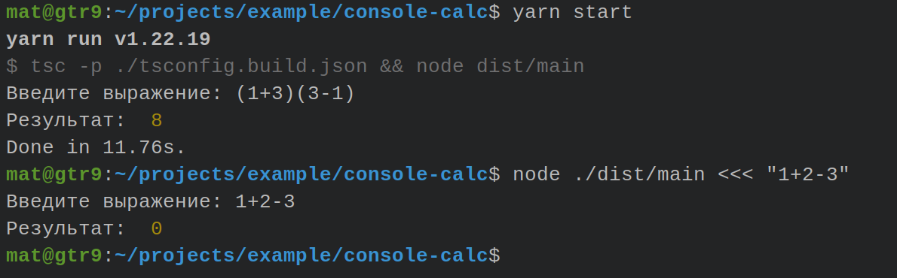

## Тестовое задание: консольный калькулятор


### Задание

> В качестве тестового задания предлагаем написать на Node.js консольный калькулятор (можно с веб-интерфейсом), который принимает входную строку, содержащую математическое выражение (целые и десятично-дробные числа, знаки +, -, *, / и скобки) и выводит в консоль результат его вычисления. Задание предполагает самостоятельную реализацию парсинга и расчета математического выражения.
>
> Пример консольного ввода: <br />
> Введите выражение: 1+2-3 <br />
> Результат: 0

### Использование
```shell
# Установка::репозиторий

git clone https://github.com/mat-twg/example-console-calc.git .
```
```shell
# Установка::пакеты

yarn
```
```shell
# Запуск

yarn start
```
```shell
# Тесты

yarn test
```
```shell
# Тесты::покрытие

yarn test:cov
```
```shell
# Пример без ручного ввода

node ./dist/main.js <<< "1+2-3"
```

### Пример работы

